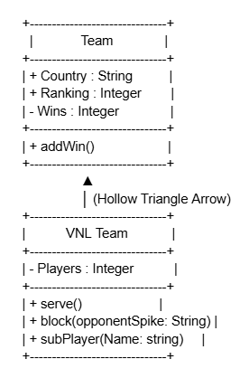
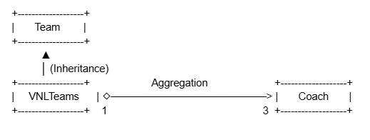
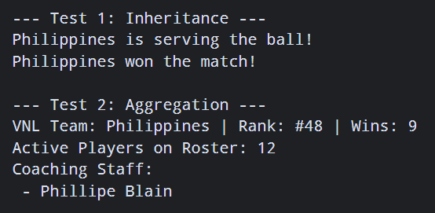
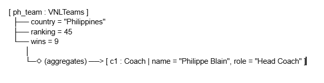

# Advanced Class Relationships

## Previous Activities
[classAttrib](classAttributesMethods.md)

[classRel](classRelationships.md)

## Existing System Description:
    The system models competitive international volleyball setups by managing base team metrics alongside detailed coaching staff aggreagtion structures.

## Inheritance Relationship

Parent: Team

Child: VNLTeams

Explanation: A VNLTeams squad IS-A specific kind of sports team. Every sports team has a country, a rank, and a win count.

## Inheritance UML

## Composition/Aggregation

Relationship: Aggregation

Explanation: A VNLTeam aggregates a Coach. The Coach objects are created outside the team and passed in. If the VNLTeam object is deleted or removed, the Coach objects still exist independently

## Advanced UML Diagram

## Python Implementation
[Source Code](advancedRelationships.py)

## Test Run

## Object Diagram

## Reflection
    1. Why did you choose your inheritance relationship? Explain why your child class is a type of your
    parent class.
        - I chose this inheritance relationship because attributes like Country, Ranking, and Wins are properties that every sports team uses. A VNLTeam is a specific type of sports team that handles international volleyball matches.Since it shares all the basic characteristics with a regular team, it makes sense to make it a child class. This fits the required IS-A design rule perfectly.
    
    2. How did inheritance reduce duplicate code? Identify attributes or methods that were reused.
        - It keeps all the shared variable inside the parent class workspace. I moved Country, Ranking, and Wins out of the child class layout. The child automatically reuses them without duplicating the initialization setup code.
    
    3. Why is your HAS-A relationship Composition or Aggregation? Explain the lifecycle relationship between the two objects.
        - The relationship is Aggregation because teams and coaches have seperate lifetimes. Coaches are created outside the team and passed through a list. If the team is deleted, the coach objects would still exist.
    
    4. What is the difference between Association from Part III and the advanced relationship you implemented?
        - The old association only showed a basic line connecting the two classes together. it did not show structural ownership or clear code dependency boundaries. Aggregation explicitly defines the team as the container tracking independent coaches.

    5. How does your design follow the DRY principle?
        - This design saves spcae by storing common features in a single location. General team attributes are only written once inside the parent class blueprint. This prevents copying and pasting identical code accross different sport files.