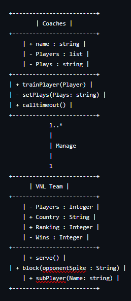
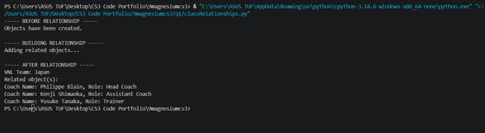
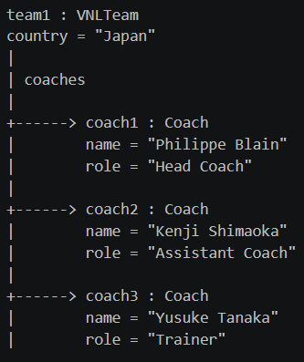

# Class Relationships: Association and Multiplicity

## Previous Work
[Part I - Classes and Objects](classObjectUML.md)

[Part II - Class Attributes and Methods](classAttributesMethods.md)

## Existing Class
Class: VNL Teams

Description: The international Volleyball teams of 18 different countries that compete in annual indoor Volleyball matches.

## New Related Class
Class: Coaches

Description: The people that strategize and call different kinds of plays during matches. Each team is only allowed to have 3 coaches on the bench during matches.

## Association
Relationship: HAS-A Relationship (Coaches manage VNL Teams)

Explanation: A VNL Team HAS-A Coaching staff that manages its strategies play calls during matches. This connects individual Coach objects to a specific VNL Team object so they can interact as a connected system.

## Multiplicity
Multiplicity: Coaches 1..* ───────── 1 VNL Team (Many-to-One)

Explanation: I think this relationship is appropriate for my system because in general, a VNL coach can only be on one team at a time. However, VNL Teams can have up to 3 coaches on the bench for each match.

## UML Class Relationship Diagram

## Python Implementation
[View Python Source](classRelationships.py)

## Test Run

## Object Relationship Diagram

## Analysis

### 1. What is the association between your two classes?
The association between my two classes is a management relationship where coaches run the volleyball teams. In this system, the team object acts as the container that holds the coaching staff. This connection allows the team to interact directly with its assigned staff during matches. It ensures that the team data and coaching data stay properly linked together

### 2. What multiplicity did you choose and why?
I chose a one-to-many multiplicity for this relationship. A single volleyball team can have up to 3 coaches managing the team while on the bench at the same time. However, an individual coach is only allowed to represent one country at a time during tournaments. This specific layout matches the real-world international volleyball rules perfectly.

### 3. How did you implement the relationship in Python?
I implemented this relationship by adding an empty list attribute inside the team class constructor. I named this list attribute coaches to hold the incoming data. Then I created a special method that appends the coach objects into a list one by one. This allows a single team object to successfully manage all of its assigned coaches.

### 4. Why did you store an object reference instead of copying its data?
Storing an object reference lets the team access the live data of the coach directly. If a coach changes their role or name, the team automatically sees the updated information without breaking. Copying the data instead would create loose duplicate strings that waste memory and get desynced easily. This reference keeps the entire system accurate and connected in real time.

### 5. If your relationship uses many, why is a list appropriate?
A list is appropriate because it can hold multiple items in a specific order. It allows the team to dynamically add or remove coaches as the staff changes. The list stores the actual memory references of the coach objects rather than just plain text. This makes it easy to loop through the staff and print out their details whenever needed.