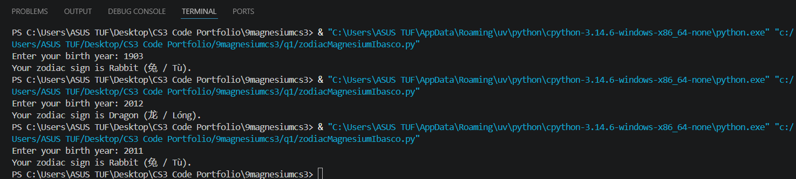

# Chinese Zodiac

**Name:** Sebastian Felix G. Ibasco

**Section:** 9 - Magnesium

**Last Name:** Ibasco

**Date:** August 18, 2026

## Requirements
a. Ask the user to enter a year of birth.  The baseline year 1900.
b. Validate user input that it should not be earlier than 1900.
c. If the user enters an invalid year then display an appropriate message then stop or abort the program.

Example:
Enter your birth year: 1800
Invalid Year, it should not be earlier than 1900

d. Otherwise determine the chinese zodiac sign based on the following starting from 1900.  Note: A zodiac sign will recur after each 12 years.

i. Rat (鼠 / Shǔ)
ii. Ox (牛 / Niú)
iii. Tiger (虎 / Hǔ)
iv. Rabbit (兔 / Tù)
v. Dragon (龙 / Lóng)
vi. Snake (蛇 / Shé)
vii. Horse (马 / Mǎ)
viii. Goat (羊 / Yáng)
ix. Monkey (猴 / Hóu)
x. Rooster (鸡 / Jī)
xi. Dog (狗 / Gǒu)
xii. Pig (猪 / Zhū)

e. CONSIDER only the year of birth.

Example input and output:
Enter your birth year: 2000
Your Chinese Zodiac Sign is: Dragon (龙 / Lóng)

## Code
```python
birthyear = int(input("Enter your birth year: "))

if birthyear < 1900:
    print("Invalid Year.")
else:
    zodiac_sign = (birthyear - 4) % 12

    if zodiac_sign == 0:
        print("Your zodiac sign is Rat (鼠 / Shǔ).")
    elif zodiac_sign == 1:
        print("Your zodiac sign is Ox (牛 / Niú).")
    elif zodiac_sign == 2:
        print("Your zodiac sign is Tiger (虎 / Hǔ).")
    elif zodiac_sign == 3:
        print("Your zodiac sign is Rabbit (兔 / Tù).")
    elif zodiac_sign == 4:
        print("Your zodiac sign is Dragon (龙 / Lóng).")
    elif zodiac_sign == 5:
        print("Your zodiac sign is Snake (蛇 / Shé).")
    elif zodiac_sign == 6:
        print("Your zodiac sign is Horse (马 / Mǎ).")
    elif zodiac_sign == 7:
        print("Your zodiac sign is Goat (羊 / Yáng).")
    elif zodiac_sign == 8:
        print("Your zodiac sign is Monkey (猴 / Hóu).")
    elif zodiac_sign == 9:
        print("Your zodiac sign is Rooster (鸡 / Jī).")
    elif zodiac_sign == 10:
        print("Your zodiac sign is Dog (狗 / Gǒu).")
    else:
        print("Your zodiac sign is Pig (猪 / Zhū).")
```

## Output
